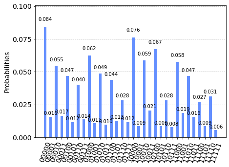

# Generalized Quantum Fourier Transform Algorithm implemented with Qiskit
The aim of this annotated notebook is to showcase the widely-used quantum fourier transform algorithm implemented with qiskit. Given a certain input quantum state, this algorithm will generate a quantum circuit that will transform the input state into the Fourier basis. 
## Procedure
1. Replication of the general QFT algorithm (in example converting 25 in decimal to Fourier basis)
2. Make sure it worked using a statevector simulator
3. Attach the inverse of the prior algorithm to be able to get definitive results
4. Run full circuit on Aer (circuit simulator)
5. Compare results to an actual quantum computer
## Results
 .png)  
Real quantum computer (former), quantum circuit simulator (latter) 😂 Quantum error correction has a long way to go...
